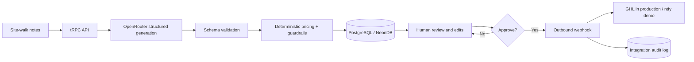

# QuoteFlow Architecture

## System Flow

## Key Decisions

**Human-in-the-loop by design.** The model drafts scope but cannot send a proposal. Marcus must review and approve. This matches his stated desire to “babysit” rather than build the system and limits hallucination risk.

**Structured AI output with deterministic totals.** The LLM returns typed scope items, assumptions, questions, and risk flags. The server validates the JSON and calculates every line and total from numeric quantity and unit-price fields. The model never supplies the final arithmetic.

**Persistent lifecycle and audit trail.** Proposals and outbound integration attempts are stored in a managed PostgreSQL/Neon database. Approval state, AI model, version, timestamps, generated content, and delivery response remain reviewable after refresh or redeploy.

**Portable AI integration.** The app integrates with OpenRouter for direct model calls (defaulting to `openai/gpt-4o-mini`, configurable via `OPENROUTER_MODEL`), with fallback to the platform's server-side LLM gateway when deployed. `openai/gpt-4o-mini` is selected because the task is structured extraction and synthesis rather than open-ended strategy; current model pricing is ~$0.15 per million input tokens and ~$0.60 per million output tokens. A representative 4,000-input/1,500-output request costs approximately $0.0015 before platform overhead.

**External integration without private client credentials.** Approval posts to a configurable `OUTBOUND_WEBHOOK_URL`, designed for a GHL inbound webhook in production. The public assessment deployment falls back to a redacted ntfy notification topic so reviewers can exercise a real external call without access to the client’s GHL account.

## Production Hardening Beyond the Assessment

A production rollout would add GHL OAuth or a private inbound webhook, import the 200+ item pricing catalog as authoritative data, require authenticated role-based access, add idempotency keys for webhook retries, use a dead-letter queue, export a branded PDF, and compare AI drafts against Marcus-approved proposals to improve prompts and measure acceptance rate.
